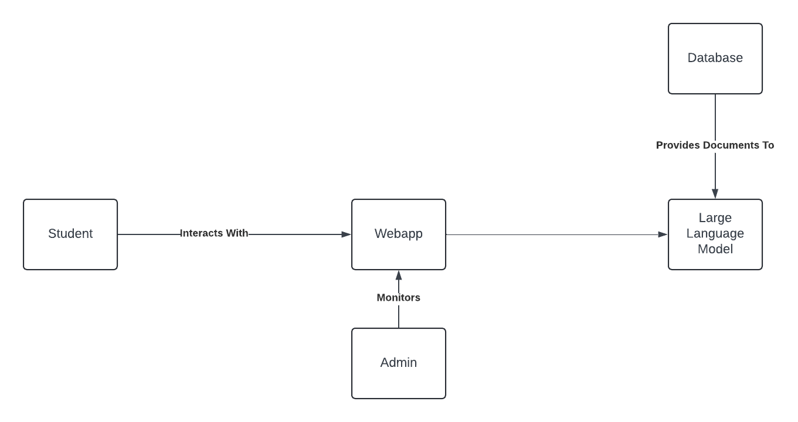

# Design Concept

  

## 1. UML Component Diagram

## 2. Technologies To be Used In Project

This project can broadly be categorised into two distinct parts:

1. Creating the AI

2. Creating a web framework that supports the AI, and allows for both users and admins to interact with the various components of the AI.

  

With regards to part 1, the technologies that will be used will be:

- Google Vertex AI

- Facebook Llama 3.1

  

With regards to part 2, the technologies that will be used will be:

- MongoDB

- Express js

- React

- Node.js

- PostGreSQL (With the PGVector extension)

- Docker

  

## 3. Reuse Plan

The following table refers to the components depicted in Section 1: the UML Component Diagram.

  

| Component | Development Approach | Comments |

|----------|----------|----------|

| Webapp| Develop| |

| Large Language Model| Reuse with modification| Use prebuilt transformer (e.g llama 3.1) and fine-tune|

| Database| Reuse generic| Use PostgreSQL with pgvector framework|

  

## 4. Learning References

A list of resources that are helpful for this project

  

### 4.1 Introduction to RAG

https://www.youtube.com/watch?v=T-D1OfcDW1M

  

### 4.2 How to Fine-Tune LLMs

https://www.youtube.com/watch?v=eC6Hd1hFvos

  

### 4.3 Fine Tuning Llama 3 and using it locally (training it on medical data)

https://www.datacamp.com/tutorial/llama3-fine-tuning-locally

  

### 4.4 Postgres tutorial with pgvector

https://www.youtube.com/watch?v=FDBnyJu_Ndg

  

## 5. Design Notebook

This project will be implemented as an external web-app, which can be accessed by canvas through an external bar (similar to how one would access the ed discussion).

### UI Coloring

 The program will have a colouring centred around the unimelb colour scheme. This is due to the AI being a unimelb-related model.

### UI Layout

As large language models are increasingly prevalent throughout the web, our goal is to build a web-app that is very similar functionally to existing technologies (e.g ChatGPT or Gemini).

Our web-app will have a sidebar which stores all chats of the user, as well as a chatbox in which the user can input prompts to chat with the large language model. 

### Other design decisions

No significant other design decisions as of yet.