<h1 style="text-align: center;">Executable Architecture Document</h1>
<h2 style="text-align: center;">Integrated AI Chat Bot in LMS</h2>
<h3 style="text-align: center;">AI Budgerigar</h3>
# Table of Contents

1. [Introduction](#introduction)  
   1.1 [Purpose](#purpose)  
   1.2 [Scope](#scope)  
   1.3 [Definitions, Acronyms and Abbreviations](#definitions-acronyms-and-abbreviations)  
   1.4 [References](#references)  
   1.5 [Overview](#overview)  

3. [Architectural Representation](#architectural-representation)

4. [Architectural Goals and Constraints](#architectural-goals-and-constraints)  
   3.1 [Technical Platform](#technical-platform)  
   3.2 [Transaction](#transaction)  
   3.3 [Security](#security)  
   3.4 [Persistence](#persistence)  
   3.5 [Reliability/Availability (Failover)](#reliabilityavailability-failover)  
   3.6 [Performance](#performance)  
   3.7 [Internationalization (i18n)](#internationalization-i18n)  
   3.8 [AI Integration and API Key Management](#ai-integration-and-api-key-management)  
   3.9 [Scalability & Flexibility](#scalability-flexibility)

5. [Use-Case View](#use-case-view)  
   4.1 [Student Use Cases](#student-use-cases)  
   4.2 [Administrators Use Cases](#administrators-use-cases)  
   4.3 [Use-Case Realizations](#use-case-realizations)

6. [Logical View](#logical-view)  
   5.1 [Overview](#overview-1)  
   5.2 [Architecturally Significant Design Packages](#architecturally-significant-design-packages)

7. [Process View](#process-view)

8. [Deployment View](#deployment-view)

9. [Implementation View](#implementation-view)  
   8.1 [Overview](#overview-2)  
   8.2 [Layers](#layers)

10. [Data View](#data-view)

11. [Size and Performance](#size-and-performance)

12. [Quality](#quality)

# Introduction

The Canvas Intelligent Plugin aims to provide an integrated learning and
teaching solution for students, teachers, and administrators. This
plugin integrates artificial intelligence technology to help users
manage courses more effectively, enhance learning outcomes, and optimize
teaching processes.

As stated in the companion article, a RUP Software Architect will
typically perform height major steps in order to define a global
architecture, and each time an activity is completed, a specific section
of the SAD is enriched accordingly.

| **Architectural activities**                         | **Software Architecture Document** |
|------------------------------------------------------|-----------------------------------|
| Step 1 - Identify and prioritize significant Use-Cases | Section 4                         |
| Step 2 - Define the candidate architecture            | Section 3, 5.1, 10, 11            |
| Step 3 - Define the initial Deployment Model          | Section 7                         |
| Step 4 - Identify key abstractions                    | Section 9                         |
| Step 5 - Create an Analysis Model                     | Section 5                         |
| Step 6 - Create the Design Model                      | Section 5                         |
| Step 7 - Document concurrency mechanisms              | Section 6, 7                      |
| Step 8 - Create the Implementation Model              | Section 8                         |

## Purpose

The Software Architecture Document (SAD) provides a comprehensive
architectural overview of the Canvas Intelligent Plugin. It presents a
number of different architectural views to depict different aspects of
the system. It is intended to capture and convey the significant
architectural decisions which have been made on the system.

In order to depict the software as accurately as possible, the structure
of this document is based on the "4+1" model view of architecture
\[KRU41\].

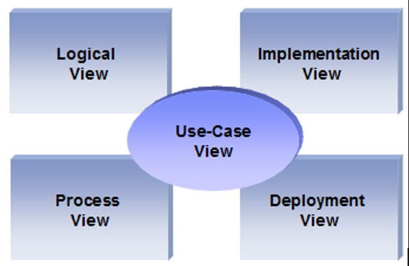

The "4+1" View Model allows various stakeholders to find what they need
in the software architecture.

## Scope

The scope of this SAD is to depict the architecture of the Canvas
Intelligent Plugin.

## Definitions, Acronyms and Abbreviations

**RUP**: Rational Unified Process

**UML:** Unified Modeling Language

**SAD:** Software Architecture Document

## References

\[KRU41\]: The "4+1" view model of software architecture, Philippe
Kruchten, November 1995,
[http://www3.software.ibm.com/ibmdl/pub/software/rational/web/whitepapers/2003/Pbk4p1.pdf](http://www3.software.ibm.com/ibmdl/pub/software/rational/web/whitepapers/2003/Pbk4p1.pdf)

\[RSA\]: IBM Rational Software Architect

<http://www-306.ibm.com/software/awdtools/architect/swarchitect/index.html>

\[RUP\]: The IBM Rational Unified Process :
<http://www-306.ibm.com/software/awdtools/rup/index.html>

\[RUPRSA\]: Developing a J2EE Architecture with Rational Software
Architect using the Rational Unified Process®, IBM DeveloperWorks,
Jean-Louis Maréchaux, Mars 2005,
<http://www-128.ibm.com/developerworks/rational/library/05/0816_Louis/>

## Overview

In order to fully document all the aspects of the architecture, the
Software Architecture Document contains the following subsections.

- **Section 2**: describes the use of each view
- **Section 3**: describes the architectural constraints of the system
- **Section 4**: describes the functional requirements with a significant impact on the architecture
- **Section 5**: describes the most important use-case realization. Will contain the Analysis Model and the Design Model
- **Section 6**: describes design’s concurrency aspects
- **Section 7**: describes how the system will be deployed. Will contain the Deployment Model
- **Section 8**: describes the layers and subsystems of the application
- **Section 9**: describes any significant persistent element. Will contain the Data Model
- **Section 10**: describes any performance issues and constraints
- **Section 11**: describes any aspects related to the quality
of service (QoS) attributes

# Architectural Representation 

This document details the architecture using the views defined in the
"4+1" model \[KRU41\], but using the RUP naming convention. The views
used to document the Canvas Intelligent Plugin are:

### Logical view
- **Audience**: Designers.  
- **Area**: Functional Requirements: describes the design's object model. Also describes the most important use-case realizations including student and administrator use cases.  
- **Related Artifacts**: Design model  

### Process view
- **Audience**: Integrators.  
- **Area**: Non-functional requirements: describes the design's concurrency and synchronization aspects.  
- **Related Artifacts**: (no specific artifact)

### Implementation view
- **Audience**: Programmers.  
- **Area**: Software components: describes the layers and subsystems of the application.  
- **Related Artifacts**: Implementation model, components  

### Deployment view
- **Audience**: Deployment managers.  
- **Area**: Topology: describes the mapping of the software onto the hardware and shows the system's distributed aspects.  
- **Related Artifacts**: Deployment model  

### Use Case view
- **Audience**: All the stakeholders of the system, including the end-users.  
- **Area**: Describes the set of scenarios and/or use cases that represent some significant, central functionality of the system, including student and administrator use cases.  
- **Related Artifacts**: Use-Case Model, Use-Case documents  

### Data view (optional)
- **Audience**: Data specialists, Database administrators  
- **Area**: Persistence: describes the architecturally significant persistent elements in the data model.  
- **Related Artifacts**: Data model

# Architectural Goals and Constraints 

This section outlines the software requirements and objectives that
significantly impact the architecture of the LMS (Learning Management
System) integrated with an AI chatbot. The architecture is designed to
ensure scalability, reliability, security, and ease of integration with
various AI tools.

## Technical Platform

The LMS will be built using the Spring ecosystem, with Spring Boot
serving as the core framework to facilitate rapid development and
deployment. The application will be containerized using Docker and
orchestrated using Kubernetes to ensure scalability and fault tolerance.
The platform will leverage PostgreSQL for relational data storage and
ElasticSearch for full-text search capabilities. The architecture will
also consider the integration of AI services via RESTful APIs or gRPC.

## Transaction

Given the transactional nature of the LMS, particularly in handling
student assessments, submissions, and AI-driven interactions, Spring's
transaction management will be crucial. The system will utilize Spring's
declarative transaction management to ensure data consistency and
integrity. In scenarios involving multiple microservices, a distributed
transaction management solution such as Spring Cloud Sleuth or a Saga
pattern will be employed to manage transactions across services.

## Security

Security is paramount in an LMS, especially one handling sensitive
educational data and user information. The architecture will incorporate
Spring Security to address various security needs:

-   Authentication & Authorization: Implemented through Spring Security
    with OAuth2.0 support, allowing role-based access controls (e.g.,
    student, instructor, admin).

-   Confidentiality & Data Integrity: All sensitive data (such as user
    information and payment details) will be encrypted using Spring
    Security's cryptographic modules. End-to-end encryption will be
    enforced.

-   Auditing & Non-repudiation: Logs of all critical actions (e.g., exam
    submissions, API key usage) will be maintained through Spring Boot
    Actuator and centralized logging systems like ELK Stack.

## Persistence 

Data persistence will be a flexible component of the architecture:

PostgreSQL or MySQL may be chosen as the relational database management
system.

In cases where Spring Boot is used, Spring Data JPA will manage data
access, whereas MyBatis will be employed in a traditional SSM setup.

ElasticSearch may be integrated for enhanced search capabilities,
particularly for AI-driven functionalities.

Caching solutions like Redis or Hazelcast may be introduced to optimize
data retrieval.

## Reliability/Availability (failover)

The LMS requires high reliability and availability:

-   High availability may be supported via Kubernetes orchestration,
    ensuring automatic failover and load balancing.

-   Stateless services, where possible, will facilitate quick recovery
    and scaling.

-   The system is designed for near-continuous availability, with
    provisions for maintenance during non-peak hours.

## Performance

The system\'s performance, particularly in AI interactions and high user
concurrency, will be a priority:

-   Response Time: Key operations should complete within 1 second to
    maintain user experience.

-   Concurrency: The architecture will support high concurrency,
    potentially leveraging Spring WebFlux for reactive programming in
    Spring Boot or optimized traditional handling in an SSM setup.

-   Scalability: Horizontal scalability will be achieved through
    containerization and orchestration.

## Internationalization (i18n)

The LMS must support multiple languages:

-   Spring Boot's internationalization capabilities (MessageSource) will
    be used, or equivalent setups in the SSM framework.

-   The application will be designed to handle various locales, ensuring
    flexibility in AI responses and other content.

## AI Integration and API Key Management

### AI Model Deployment:

-   Prebuilt Models: Initial deployment will utilize pre-trained
    transformer models, accessible through APIs like ollama.com or
    OpenAI.

-   Fine-Tuning: Fine-tuning of models will be done on-premise using
    high-performance machines (e.g., MacBook with M1/M2 chips) or
    through cloud services like Vertex AI, which offers up to \$300 in
    free credits.

-   Data Augmentation & RAG: The architecture will support RAG
    (Retrieval-Augmented Generation) techniques by integrating
    PostgreSQL with PGVector for embedding vector storage, enhancing the
    AI's contextual understanding of course materials. This will require
    vectorizing course materials and feeding them into the AI model for
    improved performance.

-   Model Training Infrastructure: If more significant AI customizations
    are needed, the architecture will allow model training using
    platforms like LM Studio. The stack includes Milvue as an
    alternative for embedding and vectorization.

### API Key Management:

Secure Management: API keys for accessing AI services will be securely
managed using Spring Cloud Config with encryption or a dedicated secrets
management tool like HashiCorp Vault. Rate limiting, monitoring, and
usage analytics will be implemented using Spring Cloud Gateway.

### AI Communication:

Routing and Traffic Management: The architecture will incorporate Spring
Cloud Gateway or similar tools to manage the communication between the
LMS and AI services, ensuring scalability and handling of traffic
surges.

## Scalability & Flexibility

The architecture will prioritize scalability, allowing horizontal
scaling of both the AI components and the core LMS functionalities.
Integration with Docker and Kubernetes will ensure containerization and
orchestration for seamless deployments across environments.

#  Use-Case View 

This section lists use cases or scenarios from the use-case model if
they represent some significant, central functionality of the final
system. Use cases are mainly divided into two types: those related to
students and those related to administrators. This section will explain
these two types of use cases separately.

## Student Use Cases

Students will connect to the LMS system and open the AI Chatbox to
access AI-related features, such as: ask questions to AI and receive
quick answers (smart chat functionality), self-assess to understand
their learning status and get system feedback (knowledge testing
integration), search for courses, exercises, multilingual translations
for personalized learning (learning resource provision). Then the AI
Service will process these requests and provide output.

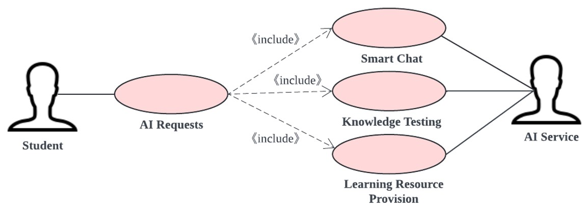

## Administrators Use Cases

The administrator can connect to the LMS system, open the AI Chatbox for
AI-related functions, such as: analyze system performance through AI
reports (system performance monitoring), and then the AI Service will
generate an AI report. At the same time, the administrator also can
collect user behavior data to understand user preferences (user data
tracking), and the data analyzer will process the student data and
provide outputs.

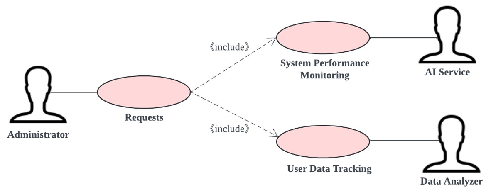

## Use-Case Realizations

Refers to section 5.2 to see how design elements provide the
functionalities identified in the significant use-cases.

Here are some Extending Use Cases:

1.  Student Use Cases:

<!-- -->

(1) Error Handling:

Extension: If the AI fails to process a request or doesn\'t understand
the query.

Extension Point: After \"AI Requests\" are made.

Trigger: AI service returns a response: \"I can\'t understand your
question\".

(2) Alternative Learning Resources:

Extension: Suggest alternative resources when requested ones are
unavailable.

Extension Point: After \"Learning Resource Provision\".

Trigger: No resources found matching the student\'s query.

2.  Administrator Use Cases:

<!-- -->

(1) Audit Trail:

Extension: Generate an audit trail for user behavior and system
performance metrics.

Extension Point: After \"System Performance Monitoring\" and \"User Data
Tracking\".

Trigger: Upon completion of data analysis.

(3) Anomaly Detection:

Extension: Detect and alert anomalies in system performance or user
behavior.

Extension Point: During \"System Performance Monitoring\" and \"User
Data Tracking\".

Trigger: Detection of patterns that deviate from the norm.

# Logical View 

## Overview

The LMS AI chatbot application is divided into layers based on the
N-tier architecture.

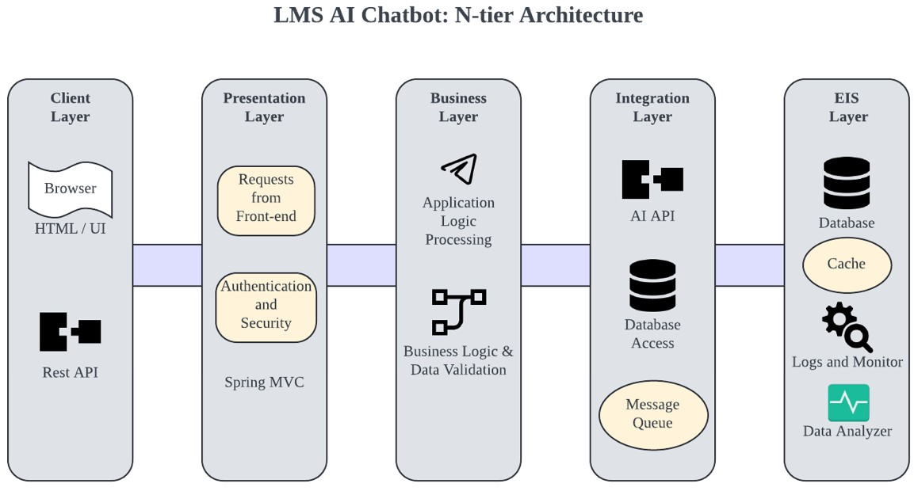

The layering model of the online catering application is based on a
responsibility layering strategy that associates each layer with a
particular responsibility.

This strategy has been chosen because it isolates various system
responsibilities from one another, so that it improves both system
development and maintenance.

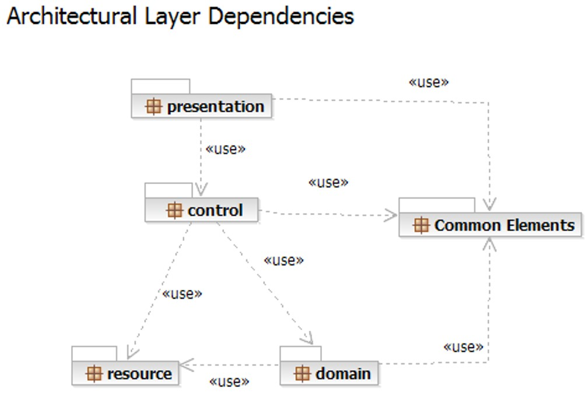

Each layer has specific responsibilities.

-   The **presentation layer** deals with the presentation logic and the
    pages rendering

-   The **control layer** manages the access to the domain layer

-   The **resource layer** (integration layer) is responsible for the
    access to the enterprise information system (databases or other
    sources of information)

-   The **domain layer** is related to the business logic and manages
    the accesses to the resource layer.

-   The **Common Elements** **layer** gathers the common objects reused
    through all the layers

External services are reused for AI functionalities.

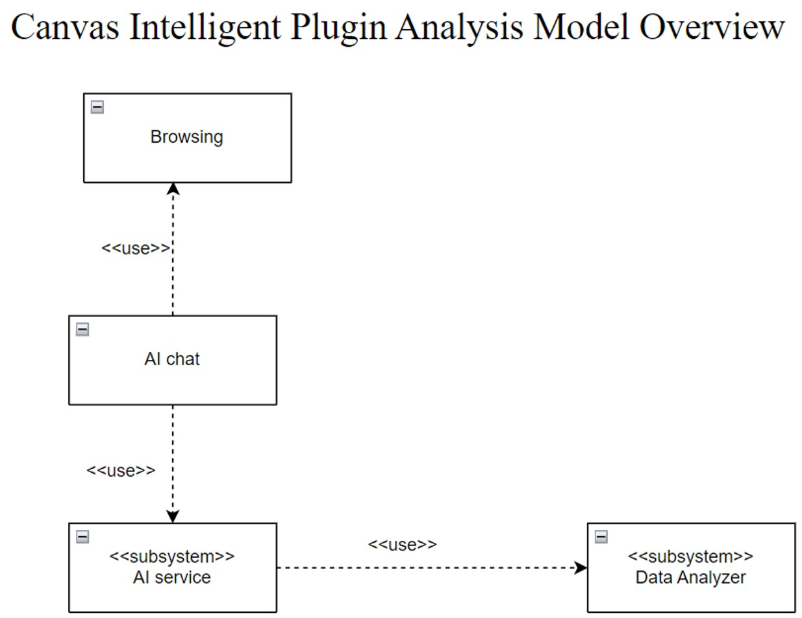

## Architecturally Significant Design Packages

### Student chat

This package is responsible for all the logic related to the student
interaction. It provides AI features and the necessary components to
access the external services.

Analysis Model

**[Participants:]{.underline}**

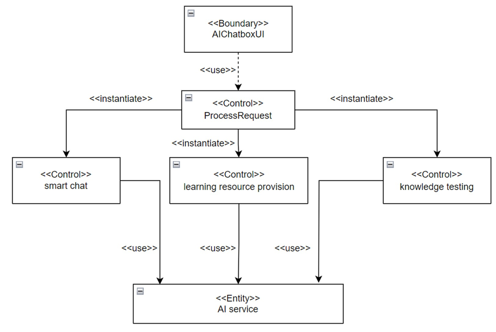

**[Basic Flow:]{.underline}**

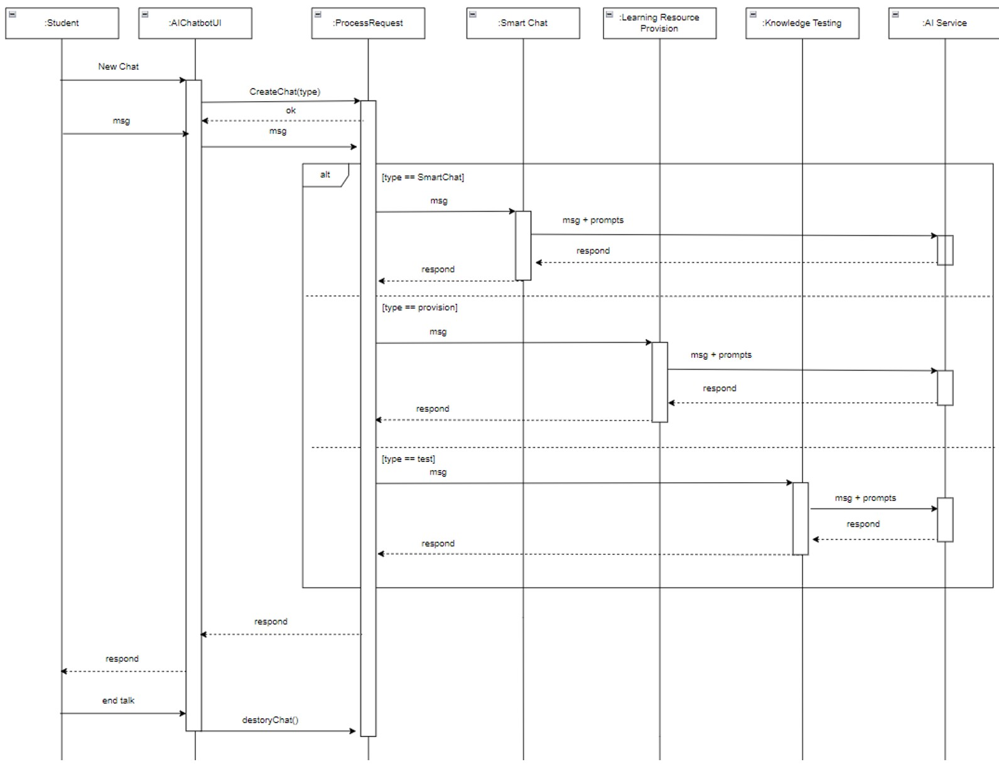

Design Model

**Process Delivery**

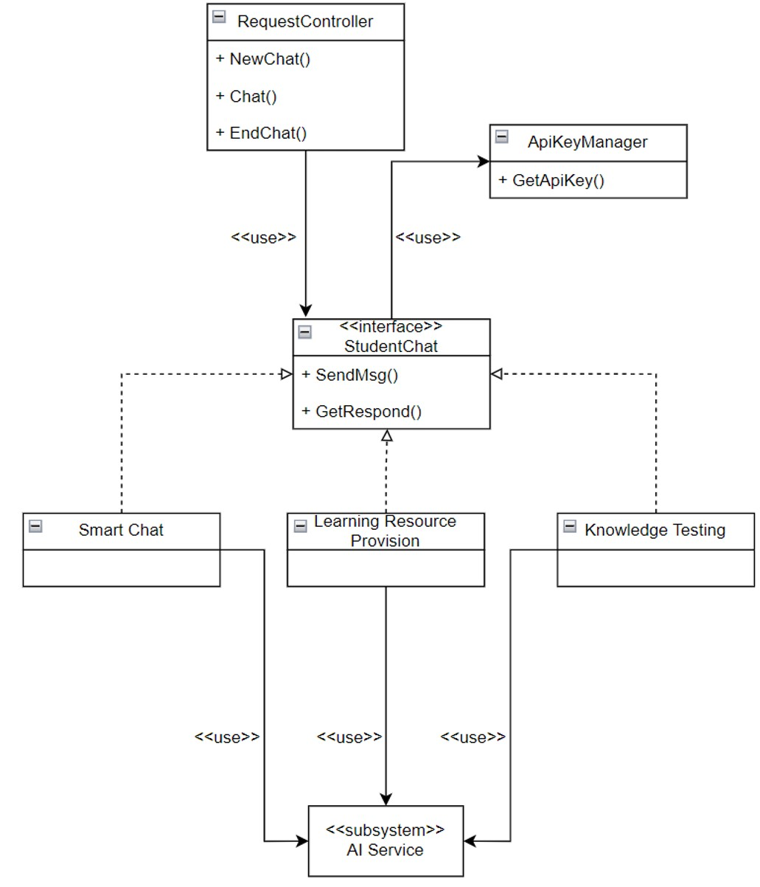

# Process View 

There's only one process to take into account. The J2EE model
automatically handles threads which are instances of this process.

# Deployment View 

**Global Overview**

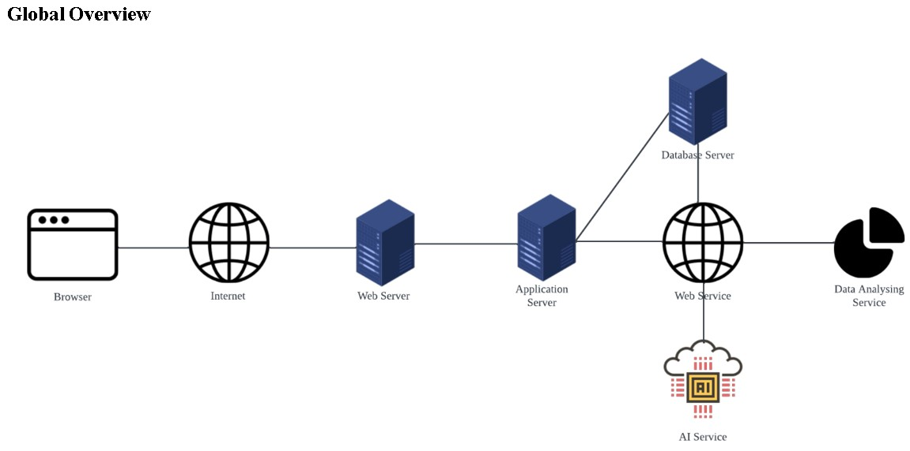

The above model will be deployed using Docker and Render.

# Implementation View 

## Overview

The Implementation view describes the physical composition of the
implementation, including Implementation Subsystems and Implementation
Elements (directories and files, including source code, data, and
executable files). Generally, the layers of the implementation view
align with those defined in the logical view. This section briefly
introduces the five Implementation layers and provides a concise
executable architecture.

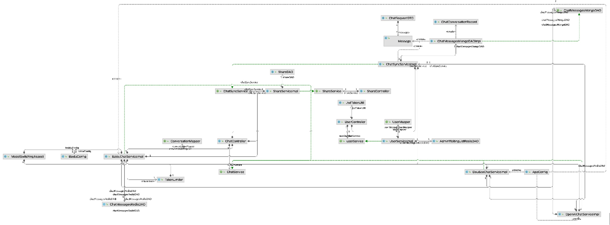

## Layers

### Presentation Layer

The Presentation layer includes everything necessary for user
interactions, encompassing the graphical user interface (GUI).

### Control Layer

The Control layer comprises all elements required to interact with the
domain layer or, when suitable, directly with the resource layer.

### Resource Layer

The Resource layer includes the components necessary to facilitate
communication between the business tier and the information systems,
such as databases and AI services.

### Domain layer

The Domain layer encompasses all elements associated with business
logic, incorporating all subsystems that address the requirements of a
specific business domain. Additionally, it includes the business object
model.

.

### Common Elements Layer

The Common Element layer houses components that are utilized across
multiple layers.

# Data View

The key data elements related to the Canvas Intelligent Plugin are:

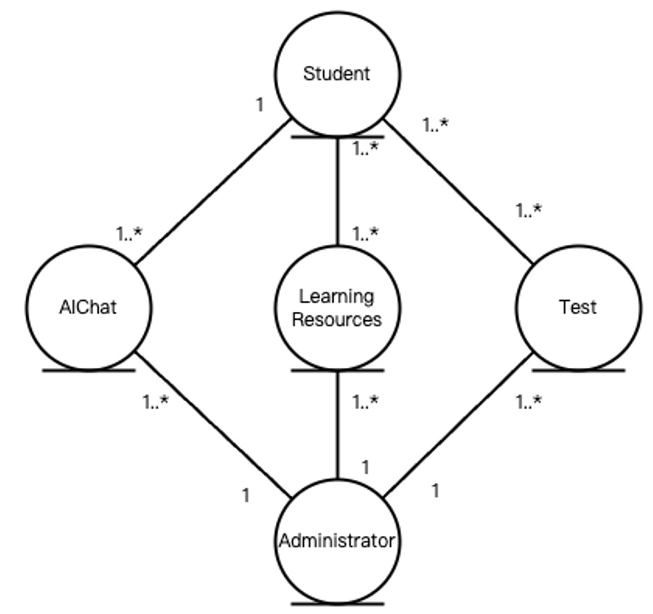

# Size and Performance 

**Volumes**:

-   An average of 40000-45000 students actively interacting with the AI
    daily.

-   Intensive data exchanges during peak hours, particularly when
    quizzes are conducted or when assignment deadlines approach.

**Performance**:

-   Response time from the AI, including data retrieval and processing
    of natural language queries, should be under 5 seconds to ensure a
    smooth user experience.

-   Quiz generation and feedback mechanisms must be efficient, capable
    of handling multiple simultaneous users without significant delays.

# Quality 

-   **Scalability**: The system must handle increases in user
    interactions, especially during exam periods or assignment
    deadlines. Scalability will be achieved using cloud-based services
    that dynamically adjust resources.

-   **Reliability and Availability**: Critical for continuous access,
    especially during peak usage. Implementations of redundancy, regular
    backups, and failover strategies will ensure high availability.

-   **Portability**: The system should be adaptable to various
    educational environments with minimal modifications. Using standard
    web technologies ensures compatibility across platforms.

-   **Security**: Secure authentication and authorization are crucial to
    protect student data and interaction logs. Standard security
    practices like HTTPS, data encryption, and regular security audits
    will be employed.
